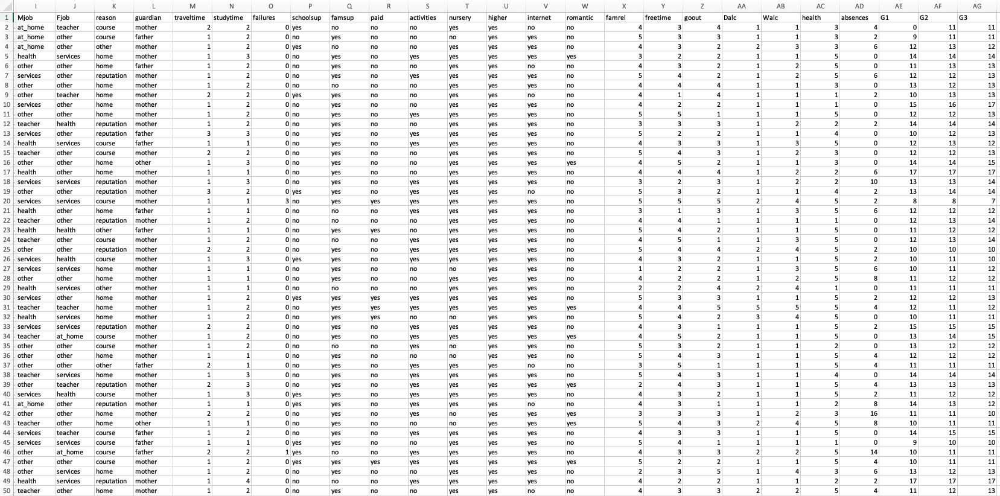
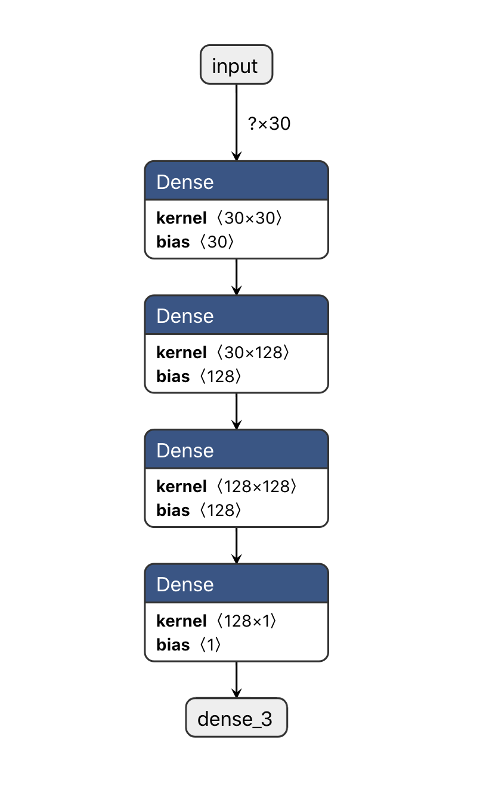

# Student-Performance-Analysis 

Deep learning-based data analytics project to predict grades of students

### Motivation

Data science is one of the most popular topic in industry. I did this project to improve myself and to see the problems arising in a real data science project

### Prerequisites
```
Tensorflow
```
```
Numpy
```
```
Pandas
```
```
Dataset: https://archive.ics.uci.edu/ml/datasets/Student+Performance
```

## Dataset
Student Performance Data Set includes 33 attribute. The first problem I encountered is labeling. I used LabelEncoder to convert labels to numerical values. After that I changed delimator because of the some issues about dataset import process



## Model
I used basic ANN to predict student grades from dataset. Structure of the my model 


## Authors

* **Fatih Canbekli** - *Initial work*

## License

This project is licensed under the MIT License - see the [LICENSE.md](LICENSE.md) file for details

##  Forward
- Detailed analysis on attributes effects
- More visualization about data 

